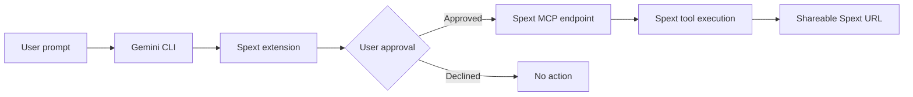

<p align="center">
  
</p>

<h1 align="center">Spext Gemini CLI Extension</h1>

<p align="center">
  Connect Spext to Gemini CLI with MCP
</p>

<div align="center">

# Spext for Gemini CLI

**Turn natural-language requests into secure, shareable Spext links—directly from your terminal.**

[](https://github.com/irontoreofficial/spext-gemini-extension)
[](https://geminicli.com/docs/extensions/)
[](https://spext.fun/api/mcp)
[](https://spext.fun)

[Website](https://spext.fun) · [Install](#installation) · [Usage](#usage) · [Gemini CLI](https://github.com/google-gemini/gemini-cli)

</div>

---

## Overview

Spext is a lightweight sharing service for publishing text, delivering private notes, and collecting files through purpose-built links. This extension connects [Gemini CLI](https://github.com/google-gemini/gemini-cli) to Spext's hosted Model Context Protocol (MCP) endpoint, enabling all three workflows through natural-language prompts.

There is no local MCP server to run, no extension-specific dependency to install, and no API endpoint to configure.

## Features

| Capability | MCP tool | What it does |
| --- | --- | --- |
| Text sharing | `create_text_share` | Publishes text and returns a shareable Spext URL. |
| Secret notes | `create_secret_note` | Creates a private note and returns a secure Spext URL. |
| File requests | `create_file_request` | Creates a link that recipients can use to upload requested files. |

## Requirements

- [Gemini CLI](https://geminicli.com/docs/get-started/) installed and authenticated
- Git, for installation from GitHub
- Internet access to the hosted MCP endpoint: [https://spext.fun/api/mcp](https://spext.fun/api/mcp)

Install Gemini CLI if needed:

```sh
npm install -g @google/gemini-cli
```

## Installation

Install the extension from GitHub:

```sh
gemini extensions install https://github.com/irontoreofficial/spext-gemini-extension
```

Then restart Gemini CLI and verify the extension:

```sh
gemini extensions list
```

> Extension management commands run in your system terminal, not inside an interactive Gemini CLI session.

## Usage

Start Gemini CLI:

```sh
gemini
```

Ask naturally—the extension supplies the relevant Spext tool when the request matches.

### Create a text share

```text
Create a Spext text share with these release notes:
Version 1.0 introduces faster onboarding and improved link sharing.
```

### Create a secret note

```text
Create a Spext secret note containing this temporary access code: 482913.
```

### Create a file request

```text
Create a Spext file request for the final brand assets.
```

Gemini may ask for missing content or options before sending the request. When successful, it returns the URL generated by Spext.

## Demo

```text
You: Create a file request for the signed agreement.

Gemini: I'll create a Spext upload link for the signed agreement.
        [Approval requested for create_file_request]

You: Approve

Gemini: Your Spext file request is ready:
        https://spext.fun/...
```

> Demo output is illustrative; the final URL and approval presentation may vary by Gemini CLI version.

## How it works



The extension registers one remote MCP connection:

```text
https://spext.fun/api/mcp
```

It does not bundle, proxy, or start a separate MCP server.

## Permissions and approvals

Gemini CLI may request confirmation before an MCP tool runs. Review the tool name and supplied inputs, especially secret or sensitive content, and approve only the action you intend to perform. Declining an approval prevents that tool call from being sent.

## Update or uninstall

Update the installed extension:

```sh
gemini extensions update spext-gemini-extension
```

Uninstall it:

```sh
gemini extensions uninstall spext-gemini-extension
```

Restart Gemini CLI after changing extension state.

## Troubleshooting

| Problem | Resolution |
| --- | --- |
| Extension is not listed | Run `gemini extensions list`, reinstall if necessary, and restart Gemini CLI. |
| Tools do not appear | Restart the active Gemini CLI session so the extension and MCP tools reload. |
| MCP connection fails | Confirm that [https://spext.fun/api/mcp](https://spext.fun/api/mcp) is reachable from your network. |
| A tool does not run | Check whether its approval request was declined or blocked by local policy. |
| Installed version is stale | Run `gemini extensions update spext-gemini-extension`, then restart Gemini CLI. |

For Gemini CLI behavior and extension management, see the official [Gemini CLI extension documentation](https://geminicli.com/docs/extensions/).

## Publish and install

This repository is ready to be distributed as a Gemini CLI extension. Before publishing a release:

1. Validate the extension from the repository root:

   ```sh
   gemini extensions validate .
   ```

2. Commit and push the release files to the default branch.
3. Create a semantic version tag or GitHub release when appropriate.
4. Share the canonical install command:

   ```sh
   gemini extensions install https://github.com/irontoreofficial/spext-gemini-extension
   ```

---

<div align="center">

Built for [Spext](https://spext.fun) and [Gemini CLI](https://github.com/google-gemini/gemini-cli).

</div>
