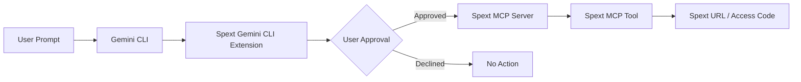

<p align="center">
  
</p>

<h1 align="center">Spext Gemini CLI Extension</h1>

<p align="center">
  <strong>Connect Gemini CLI to Spext through the Model Context Protocol (MCP).</strong>
</p>

<p align="center">
  Share text and code, create burn-after-reading secret notes, and generate file request links directly from Gemini CLI.
</p>

<p align="center">
  <a href="https://github.com/irontoreofficial/spext-gemini-extension">
    
  </a>
  <a href="https://geminicli.com/docs/extensions/">
    
  </a>
  <a href="https://spext.fun/api/mcp">
    
  </a>
  <a href="https://spext.fun">
    
  </a>
</p>

<p align="center">
  <a href="https://spext.fun">Website</a>
  ·
  <a href="#installation">Installation</a>
  ·
  <a href="#usage">Usage</a>
  ·
  <a href="#available-mcp-tools">MCP Tools</a>
  ·
  <a href="#how-it-works">Architecture</a>
  ·
  <a href="#troubleshooting">Troubleshooting</a>
</p>

---

## Spext for Gemini CLI

**Spext Gemini CLI Extension** connects Gemini CLI to the hosted **Spext MCP server**.

It allows developers to use natural-language prompts inside Gemini CLI to:

- share text through temporary Spext links,
- share source code and development notes,
- create burn-after-reading secret notes,
- create file request links,
- and receive generated Spext URLs directly in the terminal.

The extension communicates with Spext using the **Model Context Protocol (MCP)**.

Spext MCP endpoint:

```text
https://spext.fun/api/mcp
```

There is no local Spext backend to run and no separate MCP server to maintain.

---

## Features

| Feature | MCP Tool | Description |
| --- | --- | --- |
| 📝 Text Sharing | `create_text_share` | Creates temporary Spext shares for text, notes, messages, or instructions. |
| 💻 Code Sharing | `create_text_share` | Shares source code or code snippets directly from Gemini CLI. |
| 🔥 Burn-After-Reading Notes | `create_secret_note` | Creates a secret note intended for a single view. |
| 📥 File Requests | `create_file_request` | Creates a link another person can use to send requested files or text. |
| 🔗 Remote MCP Server | Spext MCP | Connects Gemini CLI directly to the hosted Spext MCP endpoint. |
| 💬 Natural-Language Workflows | Gemini CLI | Use regular prompts instead of manually calling Spext APIs. |
| ⚡ Lightweight Setup | Gemini Extension | No additional Spext runtime is required locally. |

---

## Why Spext + Gemini CLI?

Gemini CLI provides AI-assisted workflows directly inside the terminal.

Spext adds lightweight sharing workflows to that environment.

Without the extension, sharing something may involve:

```text
Terminal
   ↓
Open browser
   ↓
Open sharing service
   ↓
Paste content
   ↓
Configure sharing
   ↓
Copy URL
   ↓
Return to terminal
```

With Spext:

```text
Gemini CLI
   ↓
"Share this code with Spext for 1 hour."
   ↓
Approve MCP tool
   ↓
Receive Spext URL
```

This keeps the workflow inside the terminal and reduces unnecessary context switching.

---

## Requirements

Before installing the extension, make sure you have:

- [Gemini CLI](https://geminicli.com/docs/get-started/) installed
- Gemini CLI authenticated
- Git installed
- internet access
- access to the Spext MCP endpoint

Install Gemini CLI if necessary:

```bash
npm install -g @google/gemini-cli
```

Verify the installation:

```bash
gemini --version
```

---

## Installation

Install Spext directly from its public GitHub repository:

```bash
gemini extensions install https://github.com/irontoreofficial/spext-gemini-extension
```

Gemini CLI will display the remote MCP server used by the extension:

```text
spext
https://spext.fun/api/mcp
```

Review the information and approve the installation.

Then verify the extension:

```bash
gemini extensions list
```

You should see:

```text
spext-gemini-extension
```

If necessary, restart Gemini CLI after installation.

> Extension management commands should be executed in your system terminal rather than inside an active Gemini CLI conversation.

---

## Quick Start

Start Gemini CLI:

```bash
gemini
```

Then try:

```text
Share "Hello from Gemini CLI" with Spext for 1 hour.
```

Gemini should recognize the Spext extension and prepare a call to:

```text
create_text_share
```

You may see an approval screen similar to:

```text
Allow execution of MCP tool "create_text_share"
from server "spext"?
```

Approve the action if the inputs are correct.

Gemini can then return the generated Spext link.

---

## Usage

### Share Text

```text
Share "Hello from Gemini CLI" with Spext for 1 hour.
```

Gemini can call:

```text
create_text_share
```

---

### Share Code

```text
Create a Spext share for this code snippet that expires in 1 day:

const hello = () => {
  console.log("Hello from Gemini CLI");
};
```

This uses:

```text
create_text_share
```

---

### Share Deployment Notes

```text
Create a temporary Spext share for these deployment notes that expires in 6 hours:

Production deploy completed.
Database migration completed.
API health checks passed.
```

---

### Create a Burn-After-Reading Secret Note

```text
Create a burn-after-reading Spext note containing:

Temporary access code: 482913
```

Gemini can call:

```text
create_secret_note
```

---

### Create a File Request

```text
Create a Spext file request called "Project Documents" that stays open for 1 day.
```

Gemini can call:

```text
create_file_request
```

and return a file-request link.

---

## Available MCP Tools

### `create_text_share`

Creates a temporary Spext share containing text-based content.

Typical use cases:

- plain text
- code snippets
- release notes
- deployment notes
- configuration instructions
- messages
- setup instructions
- technical documentation excerpts

Example:

```text
Create a Spext text share for these setup notes and expire it in 1 hour.
```

Typical result:

```text
Spext share created.

URL: https://spext.fun/....
Code: ....
```

---

### `create_secret_note`

Creates a burn-after-reading secret note.

Example:

```text
Create a burn-after-reading Spext note containing "Demo message".
```

The generated note follows Spext's single-view secret-note behavior.

Use this tool only when that behavior is intentional.

---

### `create_file_request`

Creates a Spext file-request link.

Example:

```text
Create a Spext file request called "Design Assets" that stays open for 1 day.
```

The resulting URL can be shared with another person so they can send the requested files or text.

---

## Demo

```text
You:
Create a Spext file request for the signed agreement.

Gemini:
I'll use Spext to create the file request.

[Approval requested for create_file_request]

You:
Approve

Gemini:
Your Spext file request is ready:

https://spext.fun/...
```

> Exact text and approval presentation may vary between Gemini CLI versions.

---

## How It Works



### Architecture

```text
User
 │
 ▼
Gemini CLI
 │
 ▼
Spext Gemini CLI Extension
 │
 ▼
Model Context Protocol
 │
 ▼
https://spext.fun/api/mcp
 │
 ▼
Spext
```

The extension does not start or proxy another MCP server.

It connects Gemini CLI directly to Spext's hosted MCP endpoint.

---

## MCP Server

The extension connects to:

```text
https://spext.fun/api/mcp
```

Current tools exposed to Gemini CLI:

```text
create_text_share
create_secret_note
create_file_request
```

---

## Permissions and Approval

Gemini CLI may require approval before executing MCP tools.

For example:

```text
Allow execution of MCP tool "create_text_share"
from server "spext"?
```

Depending on the Gemini CLI version, approval options may include:

```text
Allow once
Allow tool for this session
Allow all server tools for this session
Decline
```

Always verify:

- which Spext tool is being called,
- what information will be submitted,
- and whether the requested action matches your intention.

Declining the approval prevents that tool invocation.

---

## Extension Management

### List Installed Extensions

```bash
gemini extensions list
```

### Update Spext

```bash
gemini extensions update spext-gemini-extension
```

### Uninstall Spext

```bash
gemini extensions uninstall spext-gemini-extension
```

Restart Gemini CLI after changing extension state if necessary.

---

## Validate the Extension

Clone the repository:

```bash
git clone https://github.com/irontoreofficial/spext-gemini-extension.git
```

Enter the directory:

```bash
cd spext-gemini-extension
```

Validate:

```bash
gemini extensions validate .
```

For local development:

```bash
gemini extensions link .
```

Verify:

```bash
gemini extensions list
```

---

## Install From GitHub

The canonical public installation command is:

```bash
gemini extensions install https://github.com/irontoreofficial/spext-gemini-extension
```

No separate Spext NPM package is required.

No local Spext MCP server installation is required.

---

## Repository Structure

```text
spext-gemini-extension/
│
├── assets/
│   └── spext-gemini-cli-banner.png
│
├── GEMINI.md
├── README.md
└── gemini-extension.json
```

### `gemini-extension.json`

Defines the Gemini CLI extension and the remote Spext MCP server.

### `GEMINI.md`

Provides extension-specific instructions and context to Gemini CLI.

### `README.md`

Contains installation, usage, MCP tool documentation, architecture, troubleshooting, and release information.

---

## Troubleshooting

| Problem | Resolution |
| --- | --- |
| Extension is not listed | Run `gemini extensions list`, reinstall if necessary, then restart Gemini CLI. |
| Spext MCP tools do not appear | Restart Gemini CLI so extensions and MCP tools are loaded again. |
| MCP connection fails | Confirm that `https://spext.fun/api/mcp` is reachable from your network. |
| Tool does not execute | Verify that its approval request was not declined. |
| Installed version is stale | Run `gemini extensions update spext-gemini-extension`. |
| Extension is already installed | Uninstall the existing extension before reinstalling it. |
| GitHub installation fails | Check Git installation, repository availability, and internet connectivity. |
| Gemini CLI requires authentication | Complete Gemini CLI authentication before trying Spext tools. |

For Gemini CLI extension documentation, see:

https://geminicli.com/docs/extensions/

---

## Development

The extension intentionally remains lightweight.

Spext's application logic and sharing backend are not duplicated in this repository.

The extension primarily provides:

```text
Gemini CLI
    +
Extension configuration
    +
Gemini context
    +
Remote Spext MCP connection
```

The actual MCP service is hosted at:

```text
https://spext.fun/api/mcp
```

---

## Publishing a New Version

Before publishing an updated version:

### 1. Validate

```bash
gemini extensions validate .
```

### 2. Test Installation

```bash
gemini extensions uninstall spext-gemini-extension
```

Then:

```bash
gemini extensions install https://github.com/irontoreofficial/spext-gemini-extension
```

### 3. Verify Tools

Test:

```text
create_text_share
create_secret_note
create_file_request
```

### 4. Update Version

Update the semantic version in:

```text
gemini-extension.json
```

Example:

```text
1.0.0
→
1.0.1
```

### 5. Commit

```bash
git add .
git commit -m "release: update Spext Gemini CLI extension"
```

### 6. Push

```bash
git push origin main
```

### 7. Optional Release

Create a Git tag or GitHub Release when appropriate.

---

## Discoverability

Spext Gemini CLI Extension is relevant to developers looking for:

- Gemini CLI extensions
- Gemini CLI plugins
- Gemini MCP integration
- MCP server for Gemini
- Model Context Protocol tools
- remote MCP servers
- Gemini developer tools
- AI developer tools
- terminal sharing tools
- code sharing from Gemini CLI
- text sharing through Gemini
- file request tools
- secret-note tools
- temporary sharing services
- MCP developer integrations

---

## Recommended GitHub Topics

Recommended repository topics:

```text
gemini-cli
gemini-cli-extension
gemini
mcp
model-context-protocol
mcp-server
developer-tools
ai-tools
cli
code-sharing
text-sharing
file-sharing
secret-notes
terminal-tools
```

---

## GitHub Repository Description

Recommended repository description:

```text
Gemini CLI extension for Spext using MCP — share text, code, burn-after-reading notes and create file request links directly from Gemini CLI.
```

---

## Links

| Resource | URL |
| --- | --- |
| Spext | https://spext.fun |
| Spext MCP Server | https://spext.fun/api/mcp |
| GitHub Repository | https://github.com/irontoreofficial/spext-gemini-extension |
| Gemini CLI | https://github.com/google-gemini/gemini-cli |
| Gemini CLI Documentation | https://geminicli.com/docs/ |
| Gemini CLI Extensions | https://geminicli.com/docs/extensions/ |
| Gemini CLI Getting Started | https://geminicli.com/docs/get-started/ |

---

## About Spext

[Spext](https://spext.fun) provides lightweight sharing workflows for text, code, notes, file requests, and other temporary sharing use cases.

The Spext Gemini CLI Extension brings selected Spext capabilities directly into **Gemini CLI** through the **Model Context Protocol (MCP)**.

The goal is simple:

> Keep developers inside their terminal while making sharing workflows faster.

---

## Disclaimer

This project integrates Spext with Gemini CLI through Gemini CLI's extension and MCP capabilities.

Gemini and Gemini CLI are Google products.

Spext is an independent project and is not presented as an official Google product.

---

<p align="center">
  <strong>Spext × Gemini CLI × MCP</strong>
</p>

<p align="center">
  Share faster. Stay in your terminal.
</p>

<p align="center">
  <a href="https://spext.fun">Spext</a>
  ·
  <a href="https://github.com/irontoreofficial/spext-gemini-extension">GitHub</a>
  ·
  <a href="https://geminicli.com/docs/extensions/">Gemini CLI Extensions</a>
</p>